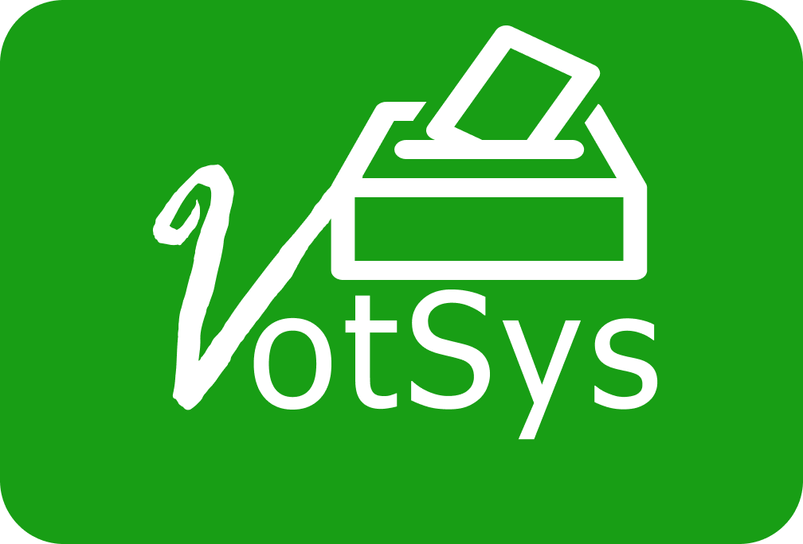

<p align="center">
  
</p>

<h1 align="center">VotSys — Online Voting System</h1>

<p align="center">
  A secure, web-based electronic voting platform designed to streamline the voting process for registered voters, aspirants, and administrators.
</p>

<p align="center">
  
  
  
  
  
</p>

---

## 📋 Table of Contents

- [Overview](#-overview)
- [Features](#-features)
- [Project Structure](#-project-structure)
- [Pages & Navigation](#-pages--navigation)
- [Tech Stack](#-tech-stack)
- [Getting Started](#-getting-started)
- [API Integration](#-api-integration)
- [User Roles](#-user-roles)
- [Contributing](#-contributing)

---

## 🗳️ Overview

**VotSys** is a frontend web application for an electronic voting system tailored for Nigerian elections and institutional balloting. It provides a **Unified Portal** with role switching for **Voters**, **Aspirants**, and **Administrators** — featuring centralized API handling, automatic session security, and digital ballot receipts.

The system communicates with a backend REST API hosted at:
```
https://votingsystemservice.herokuapp.com
```

---

## ✨ Features

### For Voters
- 🔐 **Unified Multi-Role Login** — Interactive portal with Voter, Aspirant, and Admin tabs.
- 📝 **Voter Registration** — Multi-step form collecting personal info, residential details, and ID credentials.
- 🗳️ **Cast Votes** — Browse and vote for candidates in active election positions.
- 📜 **Digital Ballot Receipt** — Generates a timestamped verification receipt with a unique cryptographic hash upon voting.
- ⏱️ **Inactivity Monitor** — Automatic auto-logout after 15 minutes of idle time for session security.

### For Aspirants
- 📋 **Aspirant Registration** — Detailed candidacy registration form including education, state of origin, and position.
- 🔐 **Aspirant Login** — Integrated aspirant authentication tab on the main portal.
- 📈 **Campaign Dashboard** — Track position standings and voter engagement.

### For Administrators
- 👥 **User Management** — View, manage, and moderate voter and aspirant accounts.
- 🏛️ **Position Settings** — Create and configure elective positions.
- ⏱️ **Time Configuration** — Set election start/end times and voting windows.

---

## 📁 Project Structure

```
VotSys/
├── index.html                  # Unified Multi-Role Login Portal (Voters / Aspirants / Admin)
├── admin-login.html            # Admin login route (forwards to index.html?role=admin)
├── aspirants-login.html        # Aspirant login route (forwards to index.html?role=aspirant)
├── aspirants-registration.html # Aspirant candidacy registration form
├── aspirants-dashboard.html    # Aspirant post-login dashboard
├── voters-registration.html    # Voter registration form
├── voters-dashboard.html       # Voter post-login dashboard
├── votes.html                  # Voting page (cast ballot & print receipt)
├── position-settings.html      # Admin — manage election positions
├── timeConfiguration.html      # Admin — configure election timing
├── user-management.html        # Admin — user account moderation
├── states.js                   # Nigerian states data (all 36 states + FCT)
└── assets/
    ├── css/
    │   ├── main.css            # Custom application styles
    │   └── bootstrap.min.css   # Bootstrap 4 stylesheet
    ├── js/
    │   ├── config.js           # Central configuration, Auth session & 15-min idle monitor
    │   └── api.js              # Centralized API gateway & AJAX request wrapper
    └── images/
        ├── VotSys_blue.png     # App logo (blue variant)
        ├── VotSys_white.png    # App logo (white variant)
        ├── login-bg.jpg        # Login background image
        ├── votsys-bg.png       # Main background asset
        └── user-profile.png    # Default user profile avatar
```

---

## 📄 Pages & Navigation

| Page | File | Role | Description |
|------|------|------|-------------|
| Unified Portal | `index.html` | All Roles | Primary entry point with tabbed switching (Voter/Aspirant/Admin) |
| Voter Registration | `voters-registration.html` | Voter | New voter registration form |
| Voter Dashboard | `voters-dashboard.html` | Voter | Voter overview & election status |
| Voting Page | `votes.html` | Voter | Cast ballot & view digital receipt modal |
| Aspirant Login | `aspirants-login.html` | Aspirant | Auto-redirects to `index.html?role=aspirant` |
| Aspirant Registration | `aspirants-registration.html` | Aspirant | Candidacy registration form |
| Aspirant Dashboard | `aspirants-dashboard.html` | Aspirant | Post-login aspirant campaign dashboard |
| Admin Login | `admin-login.html` | Admin | Auto-redirects to `index.html?role=admin` |
| User Management | `user-management.html` | Admin | Manage voter and aspirant accounts |
| Position Settings | `position-settings.html` | Admin | Create & configure election positions |
| Time Configuration | `timeConfiguration.html` | Admin | Configure election voting windows |

---

## 🛠️ Tech Stack

| Technology | Version | Purpose |
|-----------|---------|---------|
| HTML5 | — | Page structure & semantic markup |
| CSS3 | — | Custom layout & responsive styling |
| JavaScript (ES6+) | — | Frontend logic, API gateway & session security |
| Bootstrap | 4.4.1 | Responsive layout framework |
| jQuery | 3.5.1 | DOM manipulation & AJAX client |
| jQuery Validate | 1.16.0 | Client-side form validation |
| SweetAlert | Latest | Styled alert/notification modals |
| Font Awesome | 5.15.4 | Icon library |
| Google Fonts (Rubik) | — | Application typography |

---

## 🚀 Getting Started

VotSys is a static frontend web application. **To avoid browser CORS/security origin warnings (`file://`), run the project using a local HTTP server.**

### Running Locally

```bash
# Option 1 — Using Python 3 (Pre-installed on macOS)
python3 -m http.server 8080

# Option 2 — Using Node.js http-server
npx http-server /Users/mac/VotSys -p 8080
```

Then navigate to: **`http://localhost:8080`** in your web browser.

---

## 🔌 API Integration

All data operations are handled via AJAX calls through `assets/js/api.js`.

**Base URL:**
```
https://votingsystemservice.herokuapp.com
```

### Key Endpoints Used

| Method | Endpoint | Description |
|--------|----------|-------------|
| `POST` | `/voters/doLogin` | Authenticate a voter |
| `POST` | `/aspirants/doLogin` | Authenticate an aspirant |
| `POST` | `/voters/register` | Register a new voter |
| `POST` | `/aspirants/register` | Register a new aspirant |
| `GET` | `/position/gets` | Fetch active election positions |
| `GET` | `/aspirants/getByPosition/{id}` | Fetch candidates for a position |
| `POST` | `/votes/add` | Submit a ballot |

---

## 🤝 Contributing

1. **Fork** the repository
2. **Create** a feature branch: `git checkout -b feature/your-feature-name`
3. **Commit** your changes: `git commit -m "feat: add feature"`
4. **Push** to the branch: `git push origin feature/your-feature-name`
5. **Open** a Pull Request

---

<p align="center">
  Made with ❤️ — VotSys Team
</p>
